# 🧪 Test Gates for Release Pipeline

## Overview

The K.Actions.NextVersion release pipeline now includes **mandatory test gates** that prevent releases when tests fail.

## Pipeline Flow

```mermaid
graph LR
    A[Push to master] --> B{Run Tests}
    B -->|✅ Pass| C[Release Pipeline]
    B -->|❌ Fail| D[Block Release]
    C --> E[Create Tag]
    C --> F[GitHub Release]
    D --> G[Fix Tests First]
```



## Test Gates

### 🧪 Pester Tests
- **PowerShell Unit Tests**: Validates core functionality
- **Runs on**: Windows Latest (PowerShell 5.1+ and 7.x)
- **Coverage**: All public functions and edge cases

### 🔄 Integration Tests  
- **Version Detection**: Branch pattern recognition
- **Breaking Changes**: Keyword override detection
- **Auto-Discovery**: Manifest file discovery
- **End-to-End**: Complete workflow validation

### 📊 Test Results
- **Real-time feedback** with GitHub Actions summaries
- **Detailed reports** with pass/fail metrics
- **Artifact uploads** for test result analysis

## Benefits

✅ **Quality Assurance**: No broken releases  
✅ **Confidence**: All functionality tested before release  
✅ **Visibility**: Clear test results in GitHub UI  
✅ **Automation**: Zero manual intervention required  

## Usage

Tests run automatically on:
- Push to `master`/`main` 
- Pull requests to `master`/`main`
- Manual workflow dispatch

**Release behavior:**
- ✅ Tests pass → Release proceeds
- ❌ Tests fail → Release blocked

## Local Testing

```powershell
# Run the complete pipeline test
.\test-release-pipeline.ps1

# Run only Pester tests
.\test-enhanced-workflow.ps1
```

## Workflow Configuration

The test gates are configured in:
- `.github/workflows/test.yml` - Test execution
- `.github/workflows/release.yml` - Release pipeline with test dependency

Key configuration:
```yaml
jobs:
  run-tests:
    uses: ./.github/workflows/test.yml
    
  version-and-release:
    needs: run-tests  # 🚨 Critical dependency!
```

---

This ensures **zero broken releases** and maintains high code quality! 🎉
